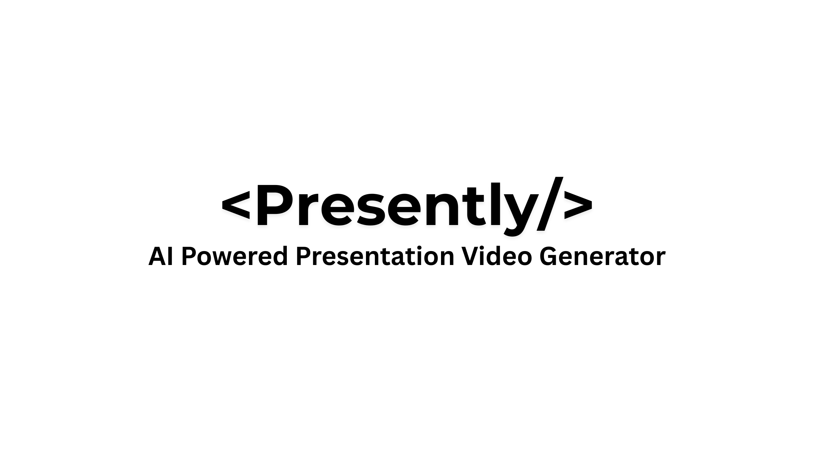

# Presently: AI-Powered Presentation Video Generator

<div align="center">
  
</div>

Presently is an automated tool that transforms web content into professional presentation videos with synchronized narration and background music. Perfect for creating quick, high-quality presentation videos from any web content.

## Architecture


## Example


## Features

- **Web Content Scraping**: Extract structured content from any website
- **AI-Powered Content Generation**: Convert web content into organized presentation slides
- **PowerPoint Generation**: Create professional PowerPoint presentations automatically
- **Text-to-Speech Narration**: Generate natural-sounding narration for each slide
- **Intelligent Music Selection**: Match background music to your presentation content
- **Video Production**: Combine slides, narration, and music into a professional video

## Requirements

### Software Dependencies

- **Python 3.8+**: Core programming language
- **LibreOffice**: For PowerPoint processing (or Microsoft PowerPoint)
- **Poppler**: For PDF processing *(required for PDF-based slide extraction)*
- **Google API Key**: For AI content generation with Google Gemini

## Installation

### Prerequisites

Before installing the Python dependencies, make sure you have the following installed:

- **Python 3.8+**: [Download Python](https://www.python.org/downloads/)
- **Git**: [Download Git](https://git-scm.com/downloads) (if cloning from repository)
- **pip**: Should come with Python, but ensure it's updated: `python -m pip install --upgrade pip`

1. **Clone the repository** (or download and extract the ZIP file)

```powershell
git clone https://github.com/saqlain2204/presently.git
cd presently
```

2. **Create and activate a virtual environment** (recommended)

```powershell
# Create a virtual environment
python -m venv venv

# Activate the virtual environment
# On Windows:
.\venv\Scripts\Activate

# On macOS/Linux:
# source venv/bin/activate
```

3. **Install Python dependencies**

```powershell
pip install -r requirements.txt
```

4. **Install LibreOffice**

- Windows: Download and install from [LibreOffice website](https://www.libreoffice.org/download/download/)
- Make sure LibreOffice is in your system PATH

5. **Install Poppler**

- Windows:
  - Download Poppler for Windows
  - Extract to a folder (e.g., `C:\poppler`)
  - Add the `bin` folder to your PATH: `setx PATH "%PATH%;C:\poppler\bin"`

1. **Set up environment variables**

Create a `.env` file in the project root with your API keys:

```
GOOGLE_API_KEY=your_google_api_key_here
```

## Project Structure

```
presently/
│
├── assets/           # Stock resources
│   └── music/        # Background music files
│
├── src/              # Source code
│   ├── main.py       # Main application entry point
│   ├── web_scraper.py
│   ├── content_generator.py
│   ├── convert_to_ppt.py
│   ├── convert_to_images.py
│   ├── text_to_audio.py
│   ├── music_selection.py
│   ├── generate_video.py
│   ├── generate_image.py
│   ├── most_similar_image.py
│   └── terminal_utils.py
│
└── temp/             # Temporary working files (created automatically)
    ├── presentation.md
    ├── presentation.ppt
    ├── presentation_video.mp4
    ├── selected_music.mp3
    ├── audio/
    ├── images/
    └── slide_images/
```

## Usage

### Basic Usage

Run the main script and follow the prompts:

```powershell
cd src
python main.py
```

When prompted, enter the URL of the webpage you want to convert into a presentation video.

### Output

The final video will be saved to `temp/presentation_video.mp4`

## Pipeline Process

1. **Web Scraping**: Extract content from the provided URL
2. **Content Generation**: Process and organize the content for presentation
3. **PowerPoint Creation**: Generate slides based on the processed content
4. **Audio Generation**: Create narration for each slide using text-to-speech
5. **Music Selection**: Choose appropriate background music based on content
6. **Video Generation**: Combine slides, narration, and music into the final video

## Customization

### Presentation Style

Modify `convert_to_ppt.py` to change the PowerPoint style, colors, or layout.

### Background Music

Place additional music files in the `assets/music` folder to expand the selection options.

## Troubleshooting

### LibreOffice Issues

- Ensure LibreOffice is installed and in your system PATH
- Try manually opening and saving a PowerPoint file to verify installation

### PDF Extraction Issues

- Check that Poppler is properly installed and in your PATH
- For Windows users: Verify the poppler bin directory is correctly added to PATH

### AI Content Generation

- Verify your Google API key is correctly set in the `.env` file
- Check for API usage limits or restrictions

## License

This project is licensed under the MIT License - see the LICENSE file for details.

## Contributing

Contributions are welcome! Please feel free to submit a Pull Request.

1. Fork the repository
2. Create your feature branch (`git checkout -b feature/amazing-feature`)
3. Commit your changes (`git commit -m 'Add some amazing feature'`)
4. Push to the branch (`git push origin feature/amazing-feature`)
5. Open a Pull Request
